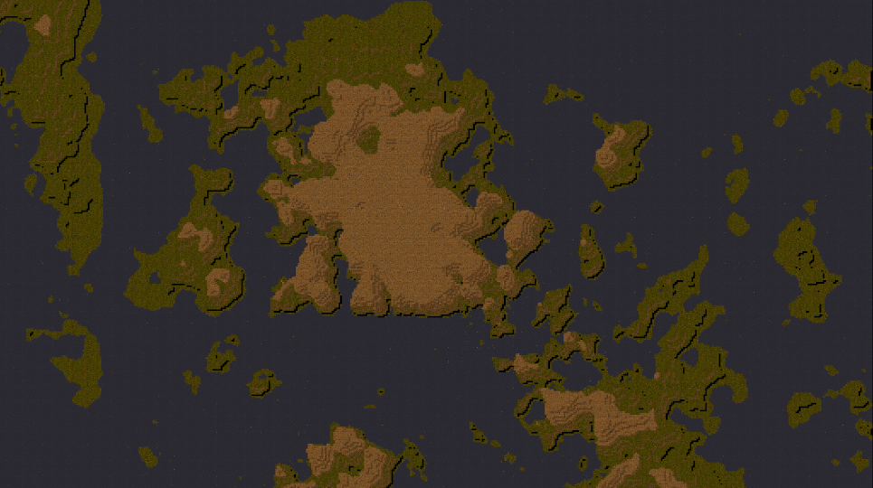

# OTMapGen

Simple prototype for a simplex noise seeded OpenTibia map generator. This generator uses 2D simplex noise to create releastic terrain. Automatic bordering is included.

  

# Dependencies

* OTBM2JSON (https://github.com/Inconcessus/OTBM2JSON)
* NodeJS

# Usage

Modify the noise seed and change some generation parameters inside the script. Then call the script and look for the output `map.otbm`.

    node OTMapGen.js 
    
# Version

Version 0.1.0. This is a work in progress.
