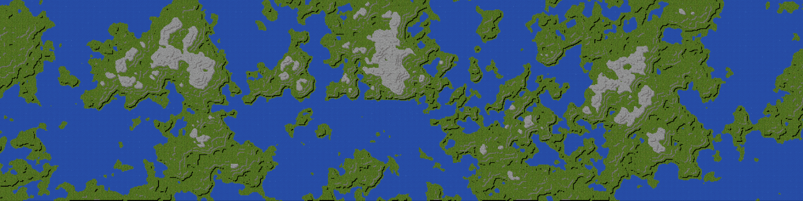

  

# Procedural Generation of Open Tibia maps

This contribution describes the in-depth design of OTMapGen: a tool for the procedural generation of Open Tibia maps.

Mapping is a term that describes level editing for the previously popular isometric MMORPG Tibia (http://www.tibia.com). Open Tibia is an open-source project that emulates an official Tibia server. Developers can design a server with custom areas, monsters, quests, and other types of game content.

In Tibia, the world is built from 32x32 pixel sprites. Historically, areas used to be designed by hand, with each tile of the tile set deliberately placed. In recent years, tools (e.g. Remere's Map Editor) introduced automatic features: e.g. tile brushing and automated bordering between adjacent tiles.

World maps are saved in the OTBM format. To create world maps we must begin with an application that can read & write from and to this binary file format.

## Chapter 1: working with the OTBM file format

### 1.1 OTBM2JSON

OTBM2JSON is a NodeJS library written to parse the OTBM files to an intermediary JSON structure. This structure can be programatically modified and written back to the OTBM format. For a detailed implementation please refer to the GitHub repository: [https://github.com/Inconcessus/OTBM2JSON](https://github.com/Inconcessus/OTBM2JSON). Below is a description of the OTBM format and its implemetation in the OTBM2JSON library.

### 1.2 OTBM Format Description

The Open Tibia Binary Mapping (OTBM) format is the prevalent format for creating, sharing, and using world maps. Following is a comprehensive description of the binary format. Please note that the byte order of this format is little endian with the least significant byte first. Each file is initialized by four magic bytes:

    0x00 0x00 0x00 0x00
    0x4D 0x42 0x54 0x4F (OTBM in ASCII)

Following the file identifier is an nodal tree structure. Each node may have a type, required & optional properties, and multiple children. A new node is initialized by the magic byte `0xFE` and terminated by `0xFF`. Characters followed by `0xFD` are escaped and interpreted as literal.

When a new node is initialized before the current node is terminated, it becomes a child of its parent node. The first byte after the initialization byte determines the type of the node:

    0x00 OTBM_MAP_HEADER
    0x02 OTBM_MAP_DATA
    0x04 OTBM_TILE_AREA
    0x05 OTBM_TILE
    0x06 OTBM_ITEM
    0x0C OTBM_TOWNS
    0x0D OTBM_TOWN
    0x0E OTBM_HOUSETILE
    0x0F OTBM_WAYPOINTS
    0x10 OTBM_WAYPOINT
    
#### OTBM Nodes
##### `0x00` OTBM_MAP_HEADER
The map header contains map metadata that describes the version, height, and width. Given is an example value and the number of bytes for each field.

    0xFE 0x00
    0x02 0x00 0x00 0x00 VERSION (4 bytes) = 2
    0x00 0x08 MAP WIDTH (2 bytes) = 2048
    0x00 0x08 MAP HEIGHT (2 bytes) = 2048
    0x03 0x00 0x00 0x00 ITEM MAJOR VERSION (4 bytes) = 3
    0x39 0x00 0x00 0x00 ITEM MINOR VERSION (4 bytes) = 57
    ...
    0xFD
 
##### `0x02` OTBM_MAP_HEADER
This node type has no required attributes but only additional properties. See the header on additional properties for more information.

    0xFE 0x02
    ... additional properties
    ... children
    0xFD
    
##### `0x04` OTBM_TILE_AREA
The OTBM tile area is a parent node for tiles within its area. The size of this area is always 256x256. By using a parent-child structure the format saves space because each child tile only requires a single byte for both its coordinates in relative tile area coordinates. The tile area itself has its position defined in global coordinates and uses two bytes per coordinate. Level height in the OTBM format is limited to a single byte.

    0xFE 0x04
    0x00 0x00 X-COORDINATE (2 bytes) = 0
    0x00 0x00 Y-COORDINATE (2 bytes) = 0
    0x07 Z-COORDINATE (1 byte) = 7
    ... children
    0xFD

##### `0x05` OTBM_TILE
OTBM tiles define singular squares on the map.The tile position is given in relative coordinates to its parent tile area node. Besides the position the tile may have more properties until the node is terminated.

    0xFE 0x05
    0x00 X-COORDINATE (1 bytes) = 0
    0x00 Y-COORDINATE (1 bytes) = 0
    ... additional properties
    ... children
    0xFD

##### `0x06` OTBM_ITEM
Items are always inherently children of tiles and have a single required entity. There may be multiple additional properties that need to be read.

    0xFE 0x06
    0x64 0x00 ITEM-IDENTIFIER (2 bytes) = 100
    ... additional properties
    ... children
    0xFD

##### `0x0C` OTBM_TOWNS
Parent node for `OTBM_TOWN`.

    0xFE 0x0C
    ... children
    0xFD

##### `0x0D` OTBM_TOWN
Node that keeps information on a defined town. Some required properties are identifier, town name, and position of the temple.

    0xFE 0x0D
    0x01 0x00 TOWN-IDENTIFIER (2 bytes) = 1
    0x02 0x00 LENGTH (2 bytes) = 2
    0x72 0x73 STRING (2 bytes ASCII) = "HI"
    0x01 0x00 X-COORDINATE (1 byte) = 1
    0x02 0x00 Y-COORDINATE (1 byte) = 2
    0x03 Z-COORDINATE (1 byte) = 3
    0xFD

##### `0x0E` OTBM_HOUSETILE 
Node that has information on a tile that belongs to a house. This is different from an ordinary tile.

    0xFE 0x0E
    0x01 0x00 X-COORDINATE (1 byte) = 1
    0x02 0x00 Y-COORDINATE (1 byte) = 2
    0x03 0x00 0x00 0x00 HOUSE-IDENTIFIER (4 bytes) = 3
    ... additional properties
    ... children
    0xFD

##### `0x0F` OTBM_WAYPOINTS
Parent node for `OTBM_WAYPOINT`.

    0xFE 0x0F
    ... children
    0xFD

##### `0x10` OTBM_WAYPOINT
Information on an OTBM waypoint

    0xFE 0x10
    0x02 0x00 LENGTH (2 bytes) = 2
    0x72 0x73 STRING (2 bytes ASCII) = "HI"
    0x01 0x00 X-COORDINATE (1 byte) = 1
    0x02 0x00 Y-COORDINATE (1 byte) = 2
    0x03 Z-COORDINATE (1 byte) = 3
    0xFD

#### Additional Properties
Additional properties are strings of bytes following the fixed header of a node that define extra optional information.

    0x01 OTBM_ATTR_DESCRIPTION
    0x02 OTBM_ATTR_EXT_FILE
    0x03 OTBM_ATTR_TILE_FLAGS
    0x04 OTBM_ATTR_ACTION_ID
    0x05 OTBM_ATTR_UNIQUE_ID
    0x06 OTBM_ATTR_TEXT
    0x08 OTBM_ATTR_TELE_DEST
    0x09 OTBM_ATTR_ITEM
    0x0A OTBM_ATTR_DEPOT_ID
    0x0B OTBM_ATTR_EXT_SPAWN_FILE
    0x0D OTBM_ATTR_EXT_HOUSE_FILE
    0x0E OTBM_ATTR_HOUSEDOORID
    0x0F OTBM_ATTR_COUNT
    0x16 OTBM_ATTR_RUNE_CHARGES

##### `0x01` OTBM_ATTR_DESCRIPTION
The description attribute is used only in the map header. It begins with a two-byte number that dictates the following string length N. Following are N bytes of characters that should be interpreted as ASCII.

    0x01
    0x02 0x00 LENGTH (2 bytes) = 2
    0x72 0x73 STRING (2 bytes ASCII) = "HI"
	
##### `0x02` OTBM_ATTR_EXT_FILE
Documentation on this is missing.

##### `0x03` OTBM_ATTR_TILE_FLAGS
Following this identifier we expect four bytes that act as a bit flag for certain tile zones. Each bit of the string indicates whether one particular flag is set.

    0x03
    0x00 0x00 0x00 0x1D TILE-FLAG-SETTINGS (4 bytes) = 29
 
The flags correspond to the following bits:
    
    0x00 0x00 0x00 0x01 TILESTATE_PROTECTIONZONE (first bit)
    0x00 0x00 0x00 0x04 TILESTATE_NOPVP (third bit)
    0x00 0x00 0x00 0x08 TILESTATE_NOLOGOUT (fourth bit)
    0x00 0x00 0x00 0x10 TILESTATE_PVPZONE (fifth bit)

Any combination of these flags may be set. In this example all flags were set.
    
##### `0x04` OTBM_ATTR_ACTION_ID
Following this identifier we expect two bytes that give the item action identifier:

    0x04
    0x64 0x00 ACTION-ID (2 bytes) = 100

##### `0x05` OTBM_ATTR_UNIQUE_ID
Following this identifier we expect two bytes that give the item unique identifier:

    0x05
    0x64 0x00 UNIQUE-ID (2 bytes) = 100

##### `0x06` OTBM_ATTR_TEXT
The text attribute is generally used for text writing on signs and books. It begins with a two-byte number that dictates the following string length N. Following are N bytes of characters that should be interpreted as ASCII.

    0x06
    0x02 0x00 LENGTH (2 bytes) = 2
    0x72 0x73 STRING (2 bytes ASCII) = "HI"

##### `0x08` OTBM_ATTR_TELE_DEST
This attribute can be found on a teleporter. This teleport transports the player to the given global world coordinates.

    0x08
    0x01 0x00 X-COORDINATE (2 bytes) = 1
    0x02 0x00 Y-COORDINATE (2 bytes) = 2
    0x03 Z-COORDINATE (1 byte) = 3

##### `0x09` OTBM_ATTR_ITEM
This attribute is mainly used for giving tiles an identifier. This information is lacking from the required section of the `OTBM_TILE` node and appended here.

    0x09
    0x01 0x00 ITEM-IDENTIFIER (2 bytes) = 1

##### `0x0A` OTBM_ATTR_DEPOT_ID
Following this identifier we find a two byte number indicating the depot number. This attribute will only be found on depot items.

    0x0A
    0x01 0x00 DEPOT-IDENTIFIER (2 bytes) = 1

##### `0x0B ` OTBM_ATTR_EXT_SPAWN_FILE
Following this identifier we find the filename of the external spawn XML file.

    0x0B
    0x02 0x00 LENGTH (2 bytes) = 2
    0x72 0x73 STRING (2 bytes ASCII) = "HI"

##### `0x0D ` OTBM_ATTR_EXT_HOUSE_FILE
Following this identifier we find the filename of the external house XML file.

    0x0D
    0x02 0x00 LENGTH (2 bytes) = 2
    0x72 0x73 STRING (2 bytes ASCII) = "HI"

##### `0x0E ` OTBM_ATTR_HOUSEDOORID
The following byte is the identifier of a house door in a particular town.

    0x0E
    0x02 (1 byte) = 2

##### `0x0F ` OTBM_ATTR_COUNT
The following byte is the count of an item limited to 255.

    0x0F
    0x08 (1 byte) = 8

##### `0x16 ` OTBM_ATTR_RUNE_CHARGES 
The following byte is the count of an item limited to 255.

    0x16
    0x08 0x00 (2 bytes) = 8

### 1.3 Implementation - OTBM2JSON
With the binary format specification available, reading and writing the OTBM files is quite trivial. We can write simple recursive functions for the reading (`function readNode`) and the writing (`function writeNode`) of the nodes. For detailed information please refer to source code at the repository linked at the top of this chapter. In addition, we need to implement all data structures described above that are triggered on their respective magic initialization bytes. The last step is to remove & add the escape character for escaped literals.

## Chapter 2: Generating realistic terrain using noise functions
Noise functions (e.g. perlin, simplex) provide an easy way for generating realistic looking terrain. The transformation is a function of relative (x, y) coordinates and returns an elevation.
 
More information to be added.
